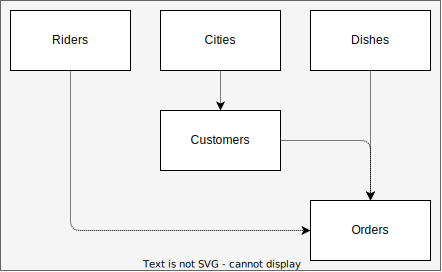

# Overview

ℹ️ This tutorial can be reset anytime via the `yarn mgmt` command selecting `Reset Tutorial`
amongst options. 

🛑 **Please don't tamper with the `.reset` folder in the root directory of this
repository**.

We have been tasked to create a CMS to visualize food delivery orders for our `food.com` company. Let's say
we have 3 entities:

1. riders
2. customers
3. orders

Riders are not referenced by any other collection, customers have an address and hence they might 
reference some location third party collection to avoid hard-coding their address on their own collection. 
That's what we will refer to as a `lookup`.
Finally orders will retain a list of dishes, a delivery time, a reference to a customer and a reference to a rider.
Moreover a concept of state (say `delivered`, `aborted`, `pending` and so on) could be useful.

