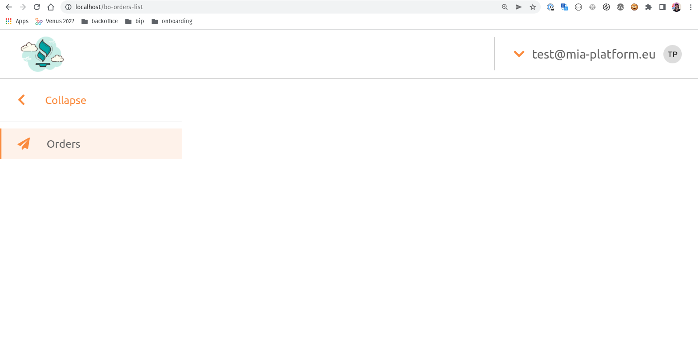

# First Plugin

Let's create a backoffice plugin for micro-lc. The aim is to create a single micro-frontend
which renders a table and thus visualize data incoming from a mongoDB collection.

## Backend: Create a CRUD collection

First of all we must mock some data. To make it as quick as possible we employ a scratchy cli. Let's type

```shell
yarn mgmt
```

and select `Add new CRUD`. 

Choose the name `riders` and confirm we'd like to use an already provided schema.

Choose `file` (on next iterations you might feel ok editing 
the default schema via an editor as `vim`) and pick the default `templates/base_schema.json` schema.

You should be ok confirming the next steps and thus confirm the creation of the new CRUD.

You should have created 1 file: `<repository-root-dir>/mocks/cruds/riders.js` and now 
let's edit it. Open it with your
favorite editor and notice it declares a 
JS Class which is constructed with a mock function. Let's add some 
fields in it.

```javascript
const mockRiders = (quantity) =>
  Array(quantity)
    .fill(0)
    .map(() => {
      return {
        ...crudBaseGenerator(),
      }
    })
```

The `crudBaseGenerator` provides some basic relational structure, namely an `_id`, creation/edit date and user
and a concept of state encapsulated in a field `__STATE__` as an enum with values `PUBLIC`, `DRAFT`, `TRASH` and 
`DELETED`.

Let's import some handy generators to build mocks. On `riders.js` add requires 

```javascript
// mocks/cruds/riders.js

const {
  genFirstName,
  genLastName,
  getRandomFromCollection
} = require('../utils/generators.js')
```

and then modify the return object of the mock function 

```javascript
// mocks/cruds/riders.js

const mockRiders = (quantity) =>
  Array(quantity)
    .fill(0)
    .map(() => {
      return {
        ...crudBaseGenerator(),
        // 👇 add from here
        firstName: genFirstName(),
        lastName: genLastName(),
        transport: getRandomFromCollection(['CAR', 'BIKE', 'MOTORBIKE'])
      }
    })
```

if the `mock-server` was watching, it'll restart, otherwise ensure to have started the development
environment via ```yarn start```.

You should be able to inspect your backend trying:

```shell
curl 'http://localhost:8080/v2/riders/?_sk=0&_l=2' | jq
```
⚠️ If you changed the default port, remember to change it too in the url 

Be sure you've installed `jq` for json pretty print. Otherwise visit the same link on the browser.

## Frontend: Configure the `riders` plugin

Let's add a new plugin in [micro-lc configuration](../micro-lc/configuration.json). In `plugins` add 
the following json code: 

```json
// micro-lc/configuration.json

{
  ...,
  "plugins": [
    {
      "id": "riders",
      "label": "Riders",
      "icon": "fas fa-biking",
      "integrationMode": "qiankun",
      "pluginRoute": "/bo-riders",
      "pluginUrl": "/element-composer/",
      "props": {
        "configurationName": "riders"
      }
    }
  ],
  ...
}
```

which instructs `micro-lc` to show a new item in the left-side menu which will have

- url: `/bo-riders`
- plugins: `element-composer`
- element-composer config: `riders.json`

let's then add a file named `riders.json` in `./mocks` with a basic layout

```json
// micro-lc/riders.json

{
  "$ref": {},
  "content": {
    "type": "row",
    "attributes": {
      "style": "min-height: 100%;"
    },
    "content": []
  }
}
```

After the `mock-server` refreshes, you might browse http://localhost:8080 which will redirect to 
the first available plugin (and the only one) and render a blank page



which though is not really blank. By inspecting the DOM tree you'd find that a new div has
been appended to the DOM within the `micro-lc` root.

```html
<div id="microlc-element-composer">
  ...
  <div style="display: flex; flex-direction: column; "></div>
</div>
```

To configure an element-composer plugin we refer to its 
[official doc](https://micro-lc.io/documentation/docs/micro-lc/core_plugins#microlc-element-composer)

Supposing you're a bit familiar with it, we emphasize that

- roughly a config object represents an `html` tag, whether custom or not
- tag properties and attributes are injected in the relative object
- amongst attributes there is `style` which inlines some css.

### Table and Client

As per the data model, we have a collection `riders` exposed by the
backend on `/v2/riders`. The `back-kit` provides a client which
matches that interface.

You could checkout the [`bk-crud-client` documentation](https://docs.mia-platform.eu/docs/business_suite/backoffice/Components/clients#bk-crud-client). Hence we could add that component by editing
the `riders.json` config

```json
// micro-lc/riders.json

{
  "$ref": {},
  "content": {
    "type": "row",
    "attributes": {
      "style": "min-height: 100%;"
    },
    "content": [
      {
        "type": "element",
        "tag": "bk-crud-client",
        "url": "/back-kit/{{BACK_KIT_VERSION}}/bk-web-components.esm.js",
        "properties": {
          "basePath": "/v2/riders"
        }
      }
    ]
  }
}
```

Since `bk-crud-client` does not render anything, the web page should not
change at all (beside the actual DOM tree), but after a default debounce
time an http GET request must be performed.

👉 the `url` parameter informs the `element-composer` to fetch a
JS ES module library from the given endpoint. This property must be
at least once on a set of components it requires it. 

👉 For instance `bk-web-components.esm.js` contains almost all the
webcomponents needed for this tutorial, hence it should be 
included once, typically on the first component is rendered (but that's
not mandatory).

Inspect the browser network (in "Network" tab) and refresh the page: you'll find an extra XHR/fetch call
pointing towards `http://localhost:8080/v2/riders/?_sk=0&_l=25` 
which retrieved data.
Then the client pipes data through the `element-composer`
communication interface, the `EventBus`, which is pub/subbed by
other components in the page.

Let's add a table using the [`bk-table` component](https://docs.mia-platform.eu/docs/business_suite/backoffice/Components/data_visualization#table)

```json
// micro-lc/riders.json

{
  "$ref": {},
  "content": {
    "type": "row",
    "attributes": {
      "style": "min-height: 100%;"
    },
    "content": [
      {
        "type": "element",
        "tag": "bk-crud-client",
        "url": "/back-kit/{{BACK_KIT_VERSION}}/bk-web-components.esm.js",
        "properties": {
          "basePath": "/v2/riders"
        }
      },
      // 👇 adding here
      {
        "type": "element",
        "tag": "bk-table"  
      }
      // 👆 up to here
    ]
  }
}
```

Without properties the table is faulty since:

- its primary color is not inherited/computed from the rest of the page
- it knows there are 25 items but it doesn't know how to render them
- it's poorly styled within the page

### Enhance the page

#### Data Schema

To describe incoming data we use a JSON 7 enriched schema. It is 
worth to stress that a standard JSON 7 schema ensures a correct render
of the table

Let's describe the data then:

```json
{
  "dataSchema": {
    "type": "object",
    "properties": {
      "_id": {
        "type": "string"
      },
      "firstName": {
        "type": "string"
      },
      "lastName": {
        "type": "string"
      }
    }
  }
}
```

and let's add it to the `riders.json` plugin table within a `$ref`
key which can be referenced from various part of the json config:

```json
// micro-lc/riders.json

{
  "$ref": {
    "dataSchema": {
      ...
    }
  },
  "content": {
    ...
    "content": [
      ...
      {
        "type": "element",
        "tag": "bk-table",
        // 👇 adding here
        "properties": {
          "dataSchema": {
            "$ref": "dataSchema"
          }
        }
        // 👆 up to here
      }
    ]
  }
}
```

and also to the `bk-crud-client`:

```json
// micro-lc/riders.json

{
  "$ref": {
    "dataSchema": {
      ...
    }
  },
  "content": {
    ...
    "content": [
      ...
      {
        "type": "element",
        "tag": "bk-crud-client",
        "url": "/back-kit/{{BACK_KIT_VERSION}}/bk-web-components.esm.js",
        "properties": {
          "basePath": "/v2/riders",
          // 👇 adding here
          "dataSchema": {
            "$ref": "dataSchema"
          }
          // 👆 up to here
        }
      },
    ]
  }
}
```

Now the table knows what we would like to show (we excluded for
instance the `createdAt` field) and how to render a type-dependent
visualization.

#### Theme

`micro-lc` provides a customizable set of css variables. One is the
`--microlc-primary-color` which can be retrieved on your browser console using the following REPL line

```javascript
window
  .getComputedStyle(document.documentElement)
  .getPropertyValue('--microlc-primary-color')
```

which should return an `hex` color like `#fa8b3e`.

Since each `back-kit` component is encapsulated in Shadow DOM with 
`mode` set to `open`, it is possible to modify inner style via 
JS procedures only.

🤡 Might be tricky but ensure there will be no css leaking.

[bk-microlc-theme-manager](https://docs.mia-platform.eu/docs/business_suite/backoffice/Components/misc#bk-layout-container)
component handles the JS injection of 
global style, hence update your config as follows:

```json
// micro-lc/riders.json

{
  "$ref": {
    "dataSchema": {
      ...
    }
  },
  "content": {
    ...
    "content": [
      ...
      {
        "type": "element",
        "tag": "bk-microlc-theme-manager"
      }
    ]
  }
}
```

#### Styling & Layout

`back-kit` here is almost done and we must provide some style to the page.
To do that we can use some inline css.

Let's design some page layout

```json
// micro-lc/riders.json

{
  "$ref": {...},
  "content": {
    ...
    "content": [
      {
        /* bk-microlc-theme-manager TAG */
      },
      {
        /* HEADER */
      },
      {
        /* MAIN */
      },
      {
        /* FOOTER */
      },
      {
        /* other clients/non-rendering components */
      }
    ]
  }
}
```

##### MAIN

We could start with the main section, remove the `bk-table` 
from its current location and nest it as follows:

```json
// micro-lc/riders.json

...
{ // MAIN
  "type": "row",
  "attributes": {
    "style": "background-color: #f0f2f5; padding: 2em 4em; flex-grow: 1"
  },
  "content": [
    {
      "type": "element",
      "tag": "bk-table",
      "properties": {
        "dataSchema": {
          "$ref": "dataSchema"
        },
        "disableRowClick": true,
        "maxLines": 8,
        "rowActions": {
          "kind": "icons",
          "actions": [
            {
              "kind": "event",
              "content": "selected-data",
              "label": "Edit Data",
              "icon": "fas fa-pen"
            }
          ]
        }
      }
    },
    {
      "type": "element",
      "tag": "bk-form-modal",
      "properties": {
        "dataSchema": {
          "$ref": "dataSchema"
        },
        "customLabels": {
          "create": {
            "title": "Add new",
            "ctaLabel": "Add"
          },
          "update": {
            "title": "Order detail",
            "ctaLabel": "Save"
          }
        }
      }
    }
  ]
}
```

👉 We added a `bk-form-modal` component which allows some item
patching. It takes a `dataSchema` reference to know how to manipulate
data and other few [settings](https://docs.mia-platform.eu/docs/business_suite/backoffice/Components/data_manipulation#form-modal)

To get some feel of the tunability here you could tune the 
`maxLines` prop and then simply refresh your browser to see 
the effect in place. 

##### FOOTER

Let's move to the footer

```json
// micro-lc/riders.json

...
{ // FOOTER
  "type": "column",
  "attributes": {
    "style": "position: sticky; justify-content: space-between; align-items: center; padding: 0.5em 4em; background-color: white; z-index: 10; bottom: 0; max-height: 5em; border-top: 1px solid #ccc; border-left: 1px solid #ccc;"
  },
  "content": [
    {
      "type": "element",
      "tag": "bk-footer"
    },
    {
      "type": "element",
      "tag": "bk-pagination",
      "properties": {
        "pageSizeOptions": [5, 10, 25],
        "pageSize": 10
      }
    }
  ]
}
```

We added a flex box with a [`bk-footer`](https://docs.mia-platform.eu/docs/business_suite/backoffice/Components/data_manipulation#bk-footer)
and a [`bk-pagination`](https://docs.mia-platform.eu/docs/business_suite/backoffice/Components/data_querying#bk-pagination)
to control

- number of elements
- state change
- pagination, intial skip and limit, pagination options

⚠️ You'll probably notice that less than a 1000 elements are available.
The CRUD interface defaults on `__STATE__ === PUBLIC` hence,
since we created random data, only a part of them is available.

##### HEADER

```json
{ // HEADER
  "type": "column",
  "attributes": {
    "style": "justify-content: space-between; padding: 10px 40px; border-bottom: 1px solid #ccc;"
  },
  "content": [
    {
      "type": "column",
      "attributes": {
        "style": "align-items: center;"
      },
      "content": [
        {
          "type": "element",
          "tag": "bk-title",
          "attributes": {
            "style": "margin-right: 20px;"
          },
          "properties": {
            "content": "Riders"
          }
        },
        {
          "type": "element",
          "tag": "bk-refresh-button"
        }
      ]
    },
    {
      "type": "element",
      "tag": "bk-button",
      "properties": {
        "content": "",
        "iconId": "PlusOutlined",
        "clickConfig": {
          "type": "event",
          "actionConfig": {
            "label": "add-new",
            "payload": {}
          }
        }
      }
    }
  ]
}
```

Here we created a header which contains a title using [`bk-title`](https://docs.mia-platform.eu/docs/business_suite/backoffice/Components/typography#bk-title),
a refresh button [`bk-refresh-button`](https://docs.mia-platform.eu/docs/business_suite/backoffice/Components/buttons#bk-refresh-button)
and a button to trigger creation of a new element. 

🌚 There's actually a button to specifically do that: `bk-add-new-button`
but we wanted to show a fully configurable button to begin with

Focusing on the [`bk-button`](https://docs.mia-platform.eu/docs/business_suite/backoffice/Components/buttons#bk-button)
we have props:

- `content` => the inner text
- `iconId` => either an [antd icon](https://ant.design/components/icon/) or a [fas/far free fontawesome icon](https://fontawesome.com/search?m=free&s=solid%2Cregular)
- `clickConfig` => what the button does on click

Notice that we told the button to emit an `event` and in `actionConfig`
we specified the `label` and the `payload` of such event.

##### BK-MICROLC-THEME-MANAGER
In this section, add the theme object created before:

```json
{
  {
    "type": "element",
    "tag": "bk-microlc-theme-manager"
  },
  {
    // header
  },
  ...
}
```

#### OTHER CLIENTS/NOT RENDERING COMPONENTS
Here, add the object regarding the crud-client:

```json
{
  ...
  {
    // footer
  },
  {
    "type": "element",
    "tag": "bk-crud-client",
    "url": "/back-kit/{{BACK_KIT_VERSION}}/bk-web-components.esm.js",
    "properties": {
      "basePath": "/v2/riders",
      "dataSchema": {
        "$ref": "dataSchema"
      }
    }
  },
}
```

### Play around

We notice that:

- we don't really need to show the `_id` on both table and form-modal
- we'd rather have labels on the table column headers
- `riders` collection has also a `transport` field which is an enum
- no label in the page supports `i18n`

Let's edit the `dataSchema`

```json
{
  "$ref": {
    "dataSchema": {
      "type": "object",
      "properties": {
        "_id": {
          "type": "string",
          "visualizationOptions": {
            "hidden": true
          },
          "formOptions": {
            "hidden": true
          }
        },
        "firstName": {
          "label": "First Name",
          "type": "string"
        },
        "lastName": {
          "label": "Last Name",
          "type": "string"
        },
        "transport": {
          "label": "Transport",
          "type": "string",
          "enum": [
            "CAR",
            "BIKE",
            "MOTORBIKE"
          ]
        }
      }
  },
  ...
}
```

and by refreshing the page we get that `_id` is hidden and the enum 
`transport` field appears as an option field in the form-modal.

Let's use a chip to make the table view of the `transport` a little
nicer

```json
{
  "$ref": {
    "dataSchema": {
      ...,
      "properties": {
        ...,
        "transport": {
          "type": "string",
          "enum": [
            "CAR",
            "BIKE",
            "MOTORBIKE"
          ],
          "visualizationOptions": {
            "tag": "bk-chip",
            "properties": {
              "value": "{{args.[0]}}",
              "valueMap": {
                "BIKE": {
                  "label": "Bike",
                  "color": "#0000ff"
                },
                "CAR": {
                  "label": "Car",
                  "color": "#ff0000"
                },
                "MOTORBIKE": {
                  "label": "Motorbike",
                  "color": "#1b8e50"
                }
              }
            }
          }
        }
      }
    }
  }
}
```

🌶️ Any `back-kit` label can be enabled to `i18n` since it is treated as
a `LocalizedString` which means it can take values as either.

⚠️ Components labels are supported only in english and italian.

1. a `string` (no `i18n`)
2. an `object` with [`ISO 639-1`](https://en.wikipedia.org/wiki/List_of_ISO_639-1_codes) keys (or their localized extensions as `en-US`, `zh-CN` or `it-IT`) and the string to print as value.

For instance, the previous chip visualization map can be changed
as follows:

```json
{
  "BIKE": {
    "label": {
      "en": "Bike",
      "zh": "自行車",
      "it": "Bici",
      "de": "Fahrrad"
    },
    "color": "#0000ff"
  },
  "CAR": {
    "label": {
      "en": "Car",
      "zh": "車",
      "it": "Auto",
      "de": "Wagen"
    },
    "color": "#ff0000"
  },
  "MOTORBIKE": {
    "label": {
      "en": "Motorbike",
      "zh": "摩托車",
      "it": "Moto",
      "de": "Motorrad"
    },
    "color": "#1b8e50"
  }
}
```
